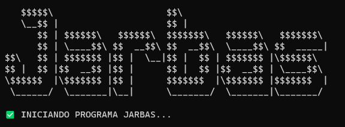

<p align="center">
    
</p>

---


---

## $$\sf \color{lightblue}Instalação$$

A instalação das dependências já são feitas pelo script desenvolvidod em powershell, mas se quiser fazer manualmente o comando é o seguinte:

```shell
pip install -q --disable-pip-version-check speechrecognition pyautogui pyaudio
```

Para rodar o projeto somente é necessário rodar o script `init.ps1` em um console powershell, mas necessita primeiro liberar acesso a leitura de scripts deve seguir os seguintes passos.

## $$\sf \color{lightblue}Configuração$$

## Colocando configuração ao iniciar o computador

- Criamos um arquivo $\sf \color{orange}.bat$ com o seguinte comando:

```shell
powershell.exe -NoLogo -NoExit -WindowStyle Maximized -File "caminho\init.ps1"
```

- Deve ser colocado o caminho completo até o arquivo `init.ps1` deste repositório.

- Colocamos esse arquivo $\sf \color{orange}.bat$ no diretório procurando no executar do windows com o comando `shell:startup`

<p align="center">
    
</p>

- Somente colocamos o arquivo dentro do diretório que abrir, dessa forma os arquivos $\sf \color{orange}.bat$ vão ser ativados no momento que o computador iniciar.

<p align="center">
    
</p>

## Programa de manter o computador ativado

- Temos juntos nesse projeto um Script que mantem o computador ativado clicando a cada 2 segundos a tecla a do teclado.
- Temos o script `runNoteAlive.bat` que ativa o arquivo python `notealive.py`

```python
import time
import keyboard

# ------------------------------------------------------------
# ESTE SCRIPT MANTÉM A TECLA "A" PRESSIONADA A CADA 3 SEGUNDOS
# ------------------------------------------------------------

while True:
    time.sleep(3)
    keyboard.press("a")
    keyboard.release("a")
```

- Temos o script $\sf \color{orange}.bat$ onde abre um notepad e ativa o arquivo python, não esqueça de mudar o caminho até o arquivo python em seu computador:

```shell
@echo off
echo ------------------------------------------
echo INICIANDO PROGRAMA DE MANTER O NOTE LIGADO
echo ------------------------------------------

start notepad.exe
python C:\Users\Gabriel_Stundner\source\repos\GITHUB\Jarbas\notealive.py
echo PROGRAMA FINALIZADO! 
```

## $$\sf \color{lightblue} Comandos$$

### Nina

Comando de ativação do script de manter o computador ligado, onde vai criar um novo terminal powershell com o nome `Nina` e iniciar o script $\sf \color{orange}.bat$ chamado `runNoteAlive.bat` que se encontra nesse repositório.

O comando que ele vai fazer no executar do windows (<kbd>Windows</kbd> + <kbd>R</kbd>) é:

```shell
powershell -NoExit -Command "$host.UI.RawUI.WindowTitle = 'Nina'; C:\caminho\runNoteAlive.bat"
```

Não esqueça de mudar o caminho até o script para o seu computador.

### Papa

Comando de parada do script de manter o computador ligado, ele vai finalizar todos os processos de bloco de notas e procurar pelo terminal powershell chamado `Nina` para finalizar ele, dessa forma não é finalizado sem querer o programa de reconhecimento de voz em um dos terminais.

O comando que ele vai fazer no executar do windows (<kbd>Windows</kbd> + <kbd>R</kbd>) é:

```shell
# Finalizando programas do bloco de notas
powershell.exe Get-Process -Name "notepad" | Stop-Process -Force

# Finalizando o terminal powershell de nome Nina
taskkill /fi "WINDOWTITLE eq Nina"
```

### Stop

Comando de finalização do projeto Jarbas, com ele é finalizado todos os terminais powershell criados pelo programa do terminal do windows (que eu utilizo em meu computador)

O comando que ele vai fazer no executar do windows (<kbd>Windows</kbd> + <kbd>R</kbd>) é:

```shell
powershell.exe Get-Process -Name "WindowsTerminal" | Stop-Process -Force
```

### Work time

Comando para iniciar o Visual Studio Code no computador.

O comando que ele vai fazer no executar do windows (<kbd>Windows</kbd> + <kbd>R</kbd>) é:

```shell
code
```

### Teams

Comando para iniciar o Microsoft Teams pelo seu executor

O comando que ele vai fazer no executar do windows (<kbd>Windows</kbd> + <kbd>R</kbd>) é:

```shell
C:\Users\Gabriel_Stundner\AppData\Roaming\Microsoft\Windows\Start Menu\Programs\Microsoft Teams (work or school).lnk
```

---

## $$\sf \color{lightblue} Código$$

- O código simples para pegar o texto de entrada de voz é o seguinte:

<p align="center">
    
</p>

- O script para iniciar no powershell tem mais detalhes, como:
  - Apresentação inicial do programa
  - Instalação das dependências do programa python
  - Inicio e fim do script python

$$\sf Código$$

<p align="center">
    
</p>

$$\sf Visualização$$

<p align="center">
    
</p>

$$\sf Código$$

<p align="center">
    
</p>

$$\sf Visualização$$

<p align="center">
    
</p>

- Exemplo do código da Nina
  - Ativa dois comandos em um novo powershell:
    - ativa um powershell com nome Nina
    - inicia o .bat com o programa de manter o computador ligado

<p align="center">
    
</p>

- Exemplo do código da Papa
  - Finaliza todos os programas notepad (bloco de notas)
  - Finaliza o powershell que tem o nome de Nina

<p align="center">
    
</p>

- Exemplo do código Stop
  - Finaliza todos os terminais que foram iniciados

<p align="center">
    
</p>

- Exemplo do código Work time
  - Inicia o visual studio code

<p align="center">
    
</p>

- Exemplo do código Teams
  - Inicia o executável da área de trabalho do seu computador

<p align="center">
    
</p>

---

<p align="center">
    
</p>

 


